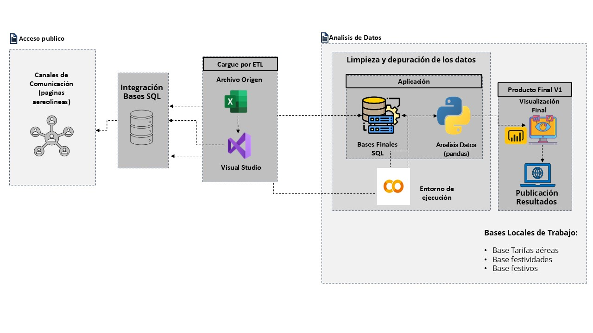
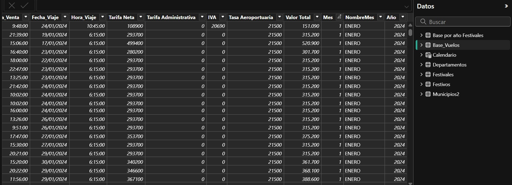
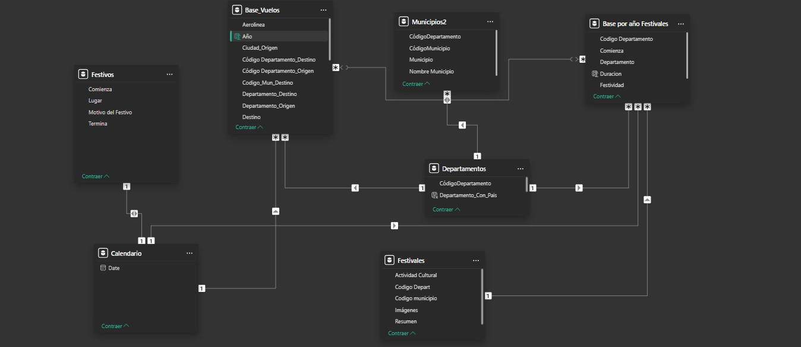
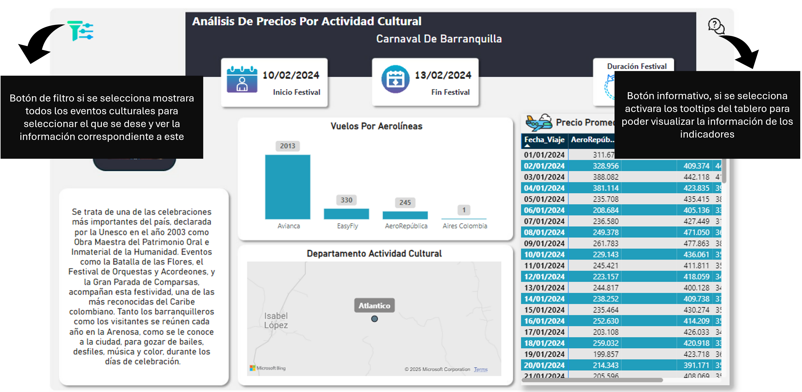
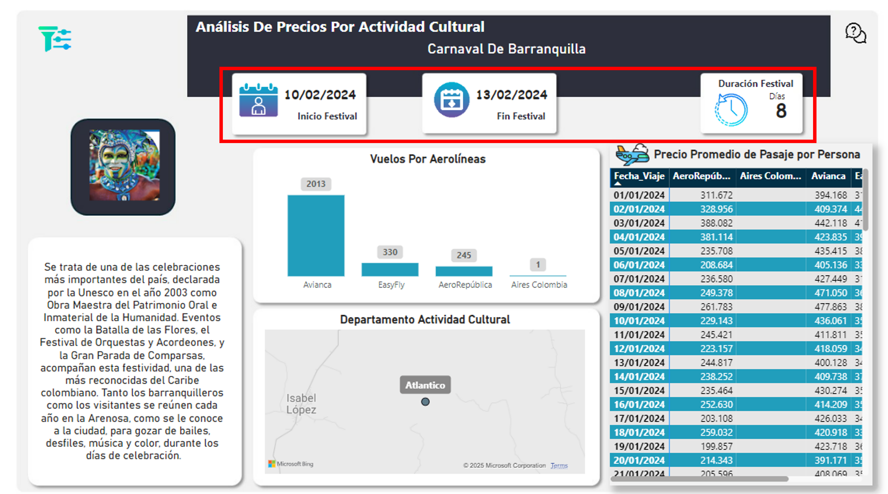
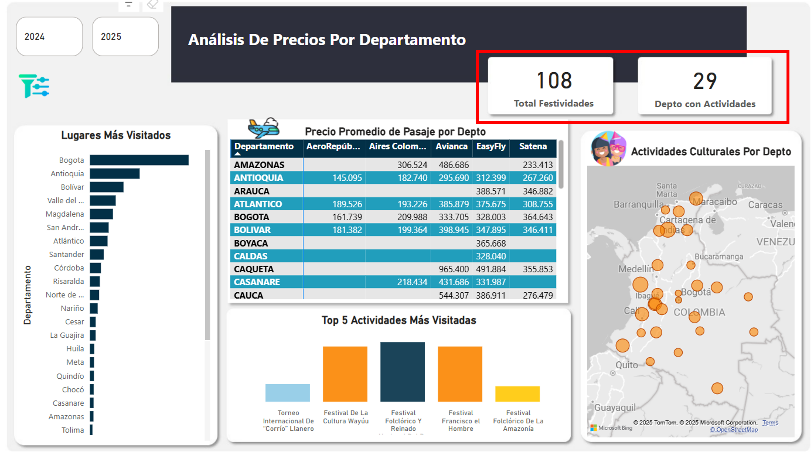
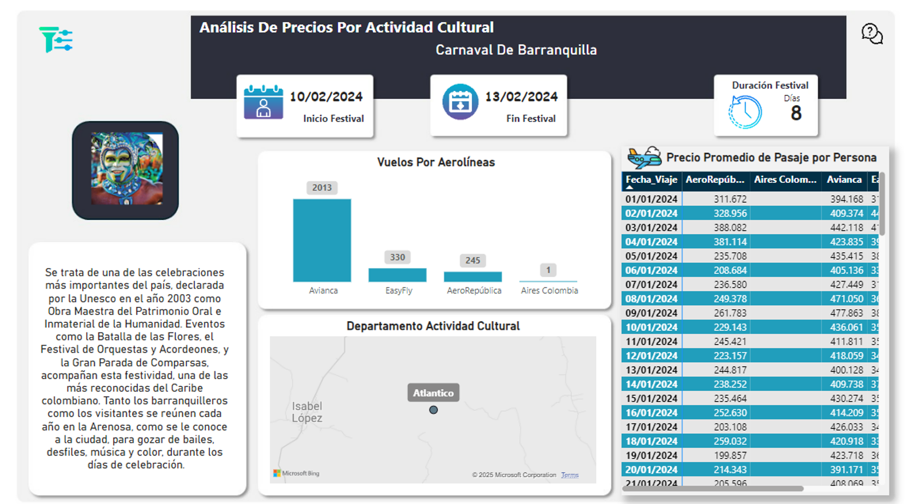
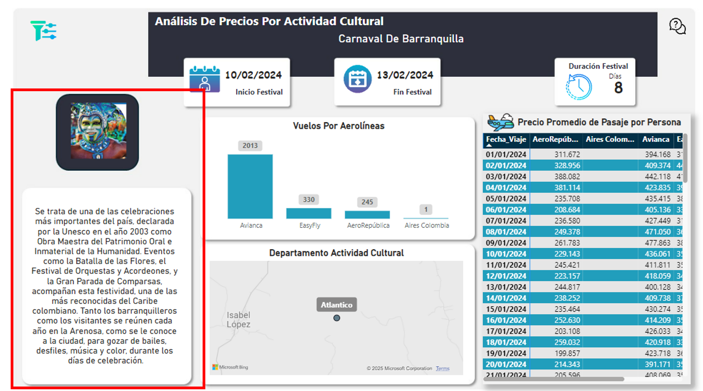
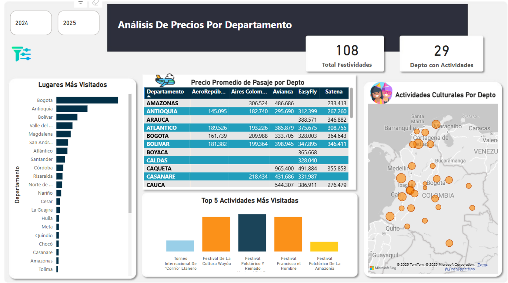

# Manual Dashboard Análisis de Precios por Ticketes Aereos

## Indice

- [Manual](#manual)
  - [Índice](#indice)
  - [1. Recursos](#1-recursos)
    - [Aliados de trabajo y herramientas](#aliados-de-trabajo-y-herramientas)
    - [Fuentes de trabajo](#fuentes-de-trabajo)
    - [Relaciones entre Tablas](#relaciones-entre-tablas)
  - [2. Herramientas](#2-herramientas)
    - [Botón de ayuda](#boton-de-ayuda)
  - [3. Indicadores tarjetas](#3-indicadores-tarjetas)
  - [4. Análisis de precios por actividad cultural](#4-analisis-de-precios-por-actividad-cultural)
    - [Indicadores gráficos](#indicadores-graficos)
    - [Cuadros Informativos](#cuadros-informativos)
  - [5. Análisis de Precios por Departamento](#5-analisis-de-precios-por-depart)
    - [Indicadores gráficos Depto](#indicadores-graficos-depto)

## 1. Recursos

### Aliados de trabajo y herramientas

[Índice](#indice)

### Fuentes de trabajo

[Índice](#indice)

### Relaciones Entre Tablas

[Índice](#indice)

## 2. Herramientas

### Botón de ayuda

Se realiza la creación de marcadores por medio de botones para facilitar la interpretación de indicadores y generar un acceso más rápido a la sección de filtros que se encuentra oculta para una mejor visualización de los datos.

[Índice](#indice)

## 3. Indicadores tarjetas

**- Inicio Festival:** Fecha en la que inicia la actividad cultural.

**- Fin Festival:** Fecha en la que termina la actividad cultural.
  
**- Duración Festival:** Total días que dura la actividad cultural.

  
**- Total Festividades:** Total festividades en el año.

**- Depto Con Actividades:** Total departamentos que cuentan con actividades culturales.

[Índice](#indice)

## 4. Análisis de precios por actividad cultural

### Indicadores gráficos

**- Vuelos por Aerolíneas:** Cuantas personas llegaron en esas fechas según cada aerolínea.

**- Departamento Actividad Cultural:** Departamento donde se va a realizar la actividad cultural realizada.
  
**- Precio promedio de pasaje por persona:** Precio promedio de pasaje por valor unitario según fechas seleccionadas.

### Cuadros Informativos

**_ Imagen y Resumen Histórico :** Cuenta con imagen representativa de la actividad cultural y un pequeño resumen para que las personas puedan conocer más sobre esta.

## 5. Análisis de Precios por Departamento

### Indicadores gráficos Depto.

**- Lugar más Visitado:** Departamento más visitado por año o por mes según la selección deseada.

**- Precio Promedio de Pasaje por Depto:** Promedio valor pasaje por aerolínea según el departamento a visitado. 
  
**- Top 5 Actividades más Visitadas:** las 5 actividades que tuvieron mayor flujo de personas según los filtros seleccionados.
  
**- Actividades Culturales por Departamento:** El mapa nos muestra los diferentes departamentos donde se realizan las actividades culturales y cuantas se realizan en cada uno.

  
[Índice](#indice)

                                                    2025 © Seminario BigData