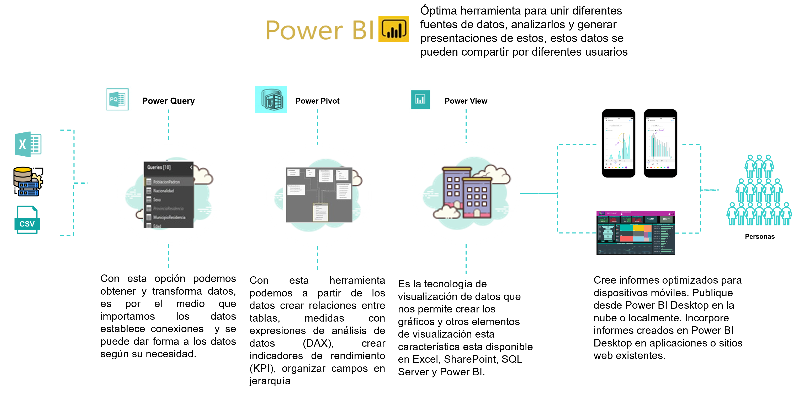
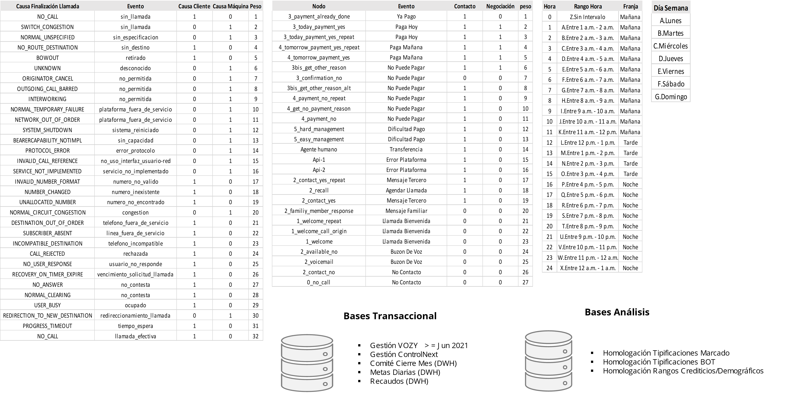
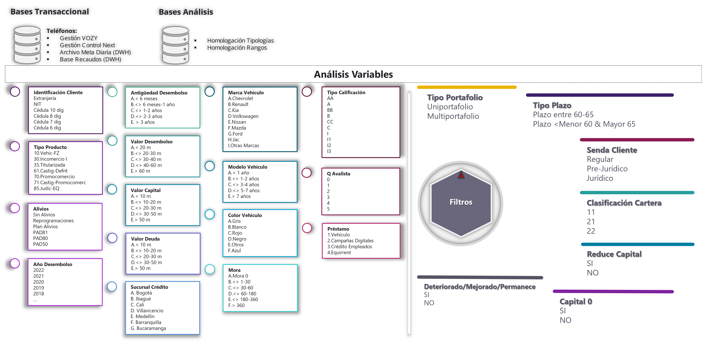
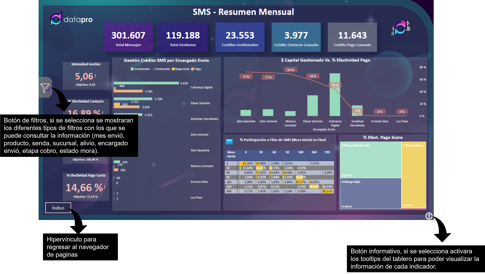
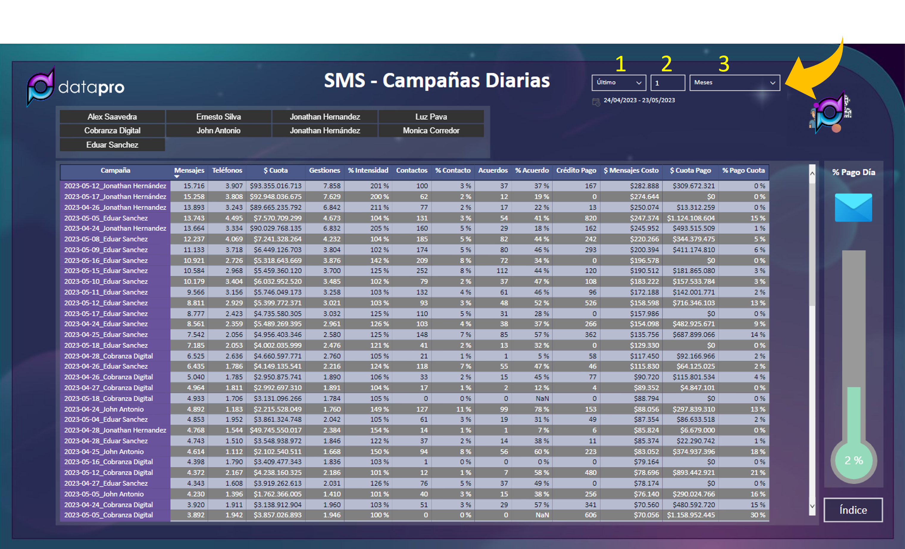
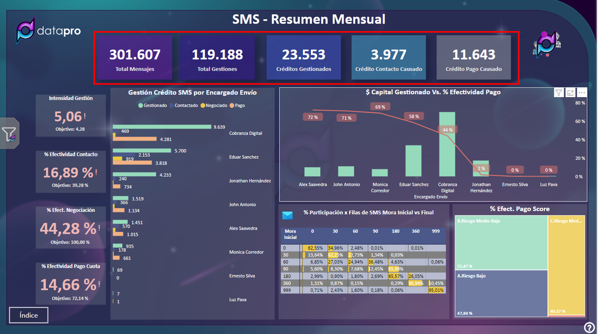
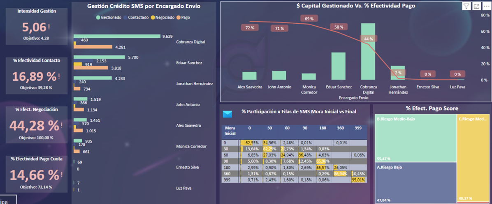
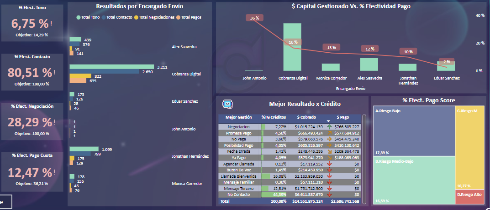
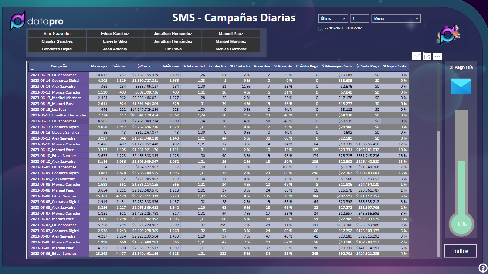
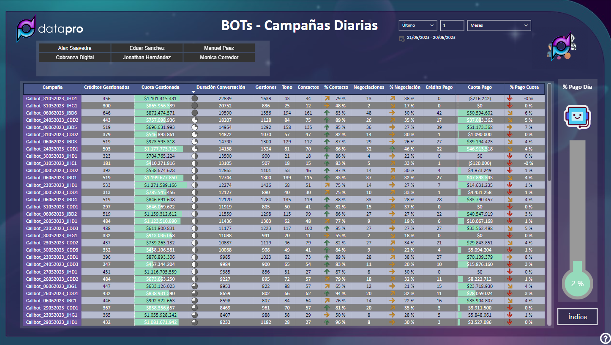

# Manual Reporte Masivos

## Indice

- [Manual Reporte Masivos](#manual-reporte-masivos)
  - [Indice](#indice)
  - [1. Recursos](#1-recursos)
    - [Aliados de trabajo y herramientas](#aliados-de-trabajo-y-herramientas)
    - [Fuentes de trabajo](#fuentes-de-trabajo)
    - [Dimensión de variables](#dimensión-de-variables)
  - [2. Herramientas](#2-herramientas)
    - [Boton de ayuda](#boton-de-ayuda)
    - [Filtro relacional](#filtro-relacional)
  - [3. Indicadores tarjetas](#3-indicadores-tarjetas)
  - [4. SMS-Resumen Mensual](#4-sms-resumen-mensual)
    - [Indicadores graficos](#indicadores-graficos)
    - [Resultado por Encargado de Envío](#resultado-por-encargado-de-envío)
    - [$ Capital Gestionado Vs %Efectividad Pago](#-capital-gestionado-vs-efectividad-pago)
    - [% Participación por filas de sms mora inicial vs final](#-participación-por-filas-de-sms-mora-inicial-vs-final)
    - [%Efectividad pago score](#efectividad-pago-score)
  - [5. BOTS-Resumen Mensual](#5-bots-resumen-mensual)
    - [Indicadores graficos Bots](#indicadores-graficos-bots)
    - [Resultados por Encargado Envío Bots](#resultados-por-encargado-envío-bots)
    - [$ Capital Gestionado Vs %Efectividad Pago Bots](#-capital-gestionado-vs-efectividad-pago-bots)
    - [% Participación por filas de sms mora inicial vs final Bots](#-participación-por-filas-de-sms-mora-inicial-vs-final-bots)
    - [%Efectividad pago score Bots](#efectividad-pago-score-bots)
  - [6. SMS - Campañas Diarias](#6-sms---campañas-diarias)
    - [% Pago Día](#-pago-día)
  - [7. BOTS - Campañas Diarias](#7-bots---campañas-diarias)
    - [% Pago Día Bots](#-pago-día-bots)
  - [5. Contacto](#5-contacto)

## 1. Recursos

### Aliados de trabajo y herramientas

[Indice](#indice)

### Fuentes de trabajo

[Indice](#indice)

### Dimensión de variables

- Optimización de intervalos, focos y prácticas de gestión y ejecución por temporalidades.

- Descripción de variables de ejecución, comportamiento y otros factores de la gestión en controlnext

- Medición y retroalimentación de focos, gestores y canales de mayor eficiencia y efectividad (comportamiento variables Score asignación C-Universe).

[Indice](#indice)

## 2. Herramientas

### Boton de ayuda

Se realiza la creación de marcadores por medio de botones para facilitar la interpretacion de indicadores y generar un acceso más rapido a la sección de filtros que se encuentra oculta para una mejor visualización de los datos.

[Indice](#indice)

### Filtro relacional

**- Primer Recuadro:** Este filtro esta habilitado para vistas en especifico como lo son las campañas diaras que se envian tanto de SMS como de CallBots,se podrá seleccionar diferentes tipos de rangos sea por meses, semanas o días.Por ejemplo: De meses se puede seleccionar la opcion “Último”, igualmente se puede seleccionar la opción “Este” para referenciar fecha o mes actual.  Evitar usar la opción “Siguiente” ya que la informacion que se almacena es día vencido.

**- Segundo Recuadro:** Escribiendo un número se podrá seleccionar la temporalidad a consultar.

**- Tercer Recuadro:** Preferiblemente seleccionar la opción “ Meses”, aunque igualmente se pueden referenciar otras temporalidades.

[Indice](#indice)

## 3. Indicadores tarjetas

**- Total Mensajes:** Total mensajes enviados (un mensaje debe tener maximo 60 caracteres, desde el caracter 61 se contara como uno nuevo).

**- Total Gestiones:** Total de gestiones por dato del cargue
  
**- Créditos Gestionados:** Total de creditos gestionados en el mes en curso
  
**- Créditos Contacto Causado:**  Créditos que generaron contacto entre los 3 días siguientes al envió del cargue.
  
**- Créditos Pago Causado:** Créditos que generaron pago entre los 3 días siguientes al envió del cargue.

  
**- Gestiones:** Total gestiones realizadas por cargue (se cuenta por dato).

**- Créditos Gestiones:** Total de créditos unicos gestionados por cargue.
  
**- Total Tono:** Se entiende cuando se marca y timbra 4 veces (teléfono es útil)
  
**- Total Contacto:** Es la confirmación del titular cuando se solicita la verificación de su identidad en el callbot.

**- Total Acuerdos:** Créditos con Promesa de pago en llamada.

[Indice](#indice)

## 4. SMS-Resumen Mensual

### Indicadores graficos

**- Intensidad Gestión:** Intensidad de sms que se envían por créditos (teléfonos/créditos).

**- %Efectividad Contacto:** Posibles contactos que se fomento por el envió de los sms ya que se tipifico como contacto entre los siguientes 3 días del envió.
  
**- %Efectividad Acuerdo:** Posibles acuerdo que se fomento por el envió de los sms ya que se tipifico como promesa de pago entre los siguientes 3 días del envió.
  
**- %Efectivcidad pago Cuota:** Posibles pago que se fomento por el envió de los sms ya que se realizo entre los siguientes 3 días del envió.

### Resultado por Encargado de Envío

Grafica de barras donde se podran visualizar 4 indicadores (gestion,contacto,negociación y pago) segun los encargados de cada envió

### $ Capital Gestionado Vs %Efectividad Pago

Se puede visualizar en esta grafica agrupada de columnas y lineas el valor capital gestionado comparado con el porcentaje de efectvidad de pago  por cada uno de los encargados de los cargues.

### % Participación por filas de sms mora inicial vs final 

En esta matriz se podra visualizar el porcentaje de participacion de los sms segun el rango de mora inicial comparado con la mora final.

### %Efectividad pago score

Porcentaje de efectvidad del posible pago que se tuvieron de los sms segun la participacion por cada uno de los tipos de riesgo.

[Indice](#indice)

## 5. BOTS-Resumen Mensual

### Indicadores graficos Bots

**- %Efectividad Tono:** Total gestiones realizadas por cargue (se cuenta por dato).

**- %Efectividad Contacto:** Total de créditos unicos gestionados por cargue.
  
**- %Efectividad Acuerdo:** Se entiende cuando se marca y timbra 4 veces (teléfono es útil)
  
**- %Efectivcidad pago Cuota:** Es la confirmación del titular cuando se solicita la verificación de su identidad en el callbot.

### Resultados por Encargado Envío Bots

Grafica de barras donde se podran visualizar 4 indicadores (Total Tono,Total contacto,acuerdo y pago) segun los encargados de cada envió.

### $ Capital Gestionado Vs %Efectividad Pago Bots

Se puede visualizar en esta grafica agrupada de columnas y lineas el valor capital gestionado comparado con el porcentaje de efectvidad de pago  por cada uno de los encargados de los cargues.

### % Participación por filas de sms mora inicial vs final Bots

En esta matriz se podra visualizar el porcentaje de participacion de los sms segun el rango de mora inicial comparado con la mora final.

### %Efectividad pago score Bots

Porcentaje de efectvidad del posible pago que se tuvieron de los sms segun la participacion por cada uno de los tipos de riesgo.

[Indice](#indice)

## 6. SMS - Campañas Diarias

**- Filtro por indicadores temporales:** Línea de tiempo por meses,días o semanas esta puede ser modificada para seleccionar un campo específico de días que no interrumpa el espacio entre tablas dinámicas.

**- Filtro por Encargados de Enviós:** Se puede filtrar la información para mostrar solo los cargues de coordinador o encargado de envio que se requiera.

- **Campaña:** Nombre de la campaña que se carga, se puede evidenciar que la estructura del nombre esta conformada por fecha y encargado del cargue.
  
- **Mensajes:** Cuantos sms salieron del cargue seleccionado.
  
- **Créditos:** Cantidad de titulares que se relacionan en la base para envió de sms.
  
- **$ Cuota:** Valor vencido a la fecha del cargue.
  
- **Teléfonos:** Cantidad de teléfonos a los que se les enviaran los sms.
  
- **% Intensudad:** Intensidad de sms que se envían por créditos (teléfonos/créditos).
  
- **Contactos:** Posible contacto que se fomento por el envió de los sms ya que se realizo entre los 3 días siguientes al envió.
  
- **% Contacto:** Porcentaje de contacto según el indicador anterior (contacto/créditos).
  
- **Acuerdos:** Posible promesa de pago que se fomento por el envió de los sms ya que se realizo entre los 3 días siguientes al envió.
  
- **% Acuerdo:** Porcentaje de promesas de pago según el indicador anterior (acuerdos/créditos).
  
- **Crédito Pago:** Posible  cantidad de créditos que pagaron fomentados por el envió de los sms ya que se realizo entre los 3 días siguientes al envió.
  
- **$ Mensajes Costo:** Costo de el cargue (cantidad de sms enviados * el costo unitario).
  
- **$ Cuota Pago:** Posible valor de pagos que se fomento por el envió de los sms ya que se realizo entre los 3 días siguientes al envió.
  
- **% Pago Cuota:** Porcentaje de pagos según el indicador anterior (valor del pago que realizaron/valor vencido a la fecha del cargue).

### % Pago Día

En este grafico de termómetro podremos visualizar como esta el porcentaje de pago al día.

[Indice](#indice)

## 7. BOTS - Campañas Diarias

**- Filtro por indicadores temporales:** Línea de tiempo por meses,días o semanas esta puede ser modificada para seleccionar un campo específico de días que no interrumpa el espacio entre tablas dinámicas.

**- Filtro por Encargados de Enviós:** Se puede filtrar la información para mostrar solo los cargues de coordinador o encargado de envio que se requiera.

- **Campaña:** En este grafico de termómetro podremos visualizar como esta el porcentaje de pago al día.
- **Créditos Gestionados:** Cantidad de créditos cargados por campaña 
- **Cuota Gestionados:** Valor vencido a la fecha
- **Duración Conversación:** Tiempo en llamada por las diferentes lineas (segundos).
- **Gestiones:** Gestiones de los telénos cargados por cada campaña (se tienen en cuenta la remarcaciones)
- **Tono:** Se entiende cuando se marca y timbra 4 veces (telefono es útil)
- **Contactos:** Es la confirmación del tituñar cuando se solicita la verificción de su identidad en el callbot
- **% Contactos:** Porcentajedel contacto segun indicador anterior (contacto/total tono)
- **Acuerdo:** Créditos con promesa de pago en llamada
- **% Acuerdo:** Porcentaje de créditos con promesa de pago segun indicador anterior (negociaciones/contactos)
- **Crédito Pago:** Cantidad de créditos que se les brindo la información por el canal del BOT y después de esta gestión pagaron en el transcurso del mes.
- **Cuota Pago:** Valor total de los créditos del indicador anterior que pagaron después de brindarse la información por el canal del BOT y pagaron en el transcurso del mes.
- **% Pago Cuota:** Porcentaje de pagos según el indicador anterior (valor del pago que realizaron/valor vencido).

### % Pago Día Bots

En este grafico de termómetro podremos visualizar como esta el porcentaje de pago al día.
  
[Indice](#indice)

## 5. Contacto

Para sugerencias,dudas o peticiones contactar a el siguiente correo (Equipo IA DataPro):

*turbot.ia@finanzauto.com.co*

                                                    2023 © DataPro